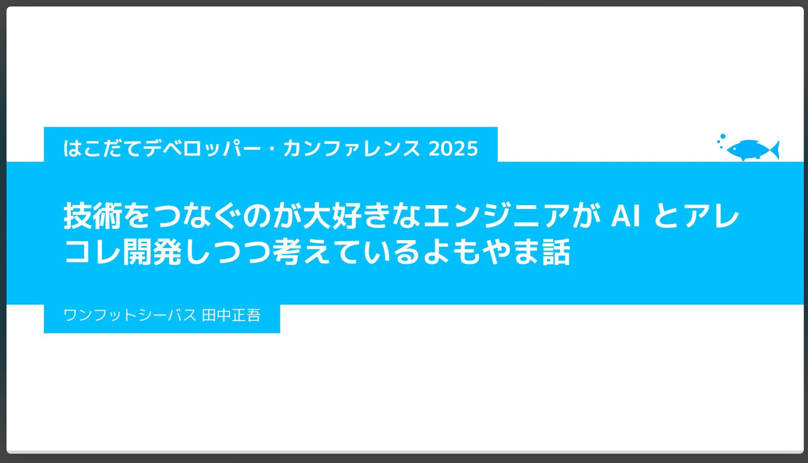

# はこだてデベロッパー・カンファレンス 2025

このページは、わたくし田中正吾の はこだてデベロッパー・カンファレンス 2025 関連のページです。

## スライド



スライドページ → <a href="https://speakerdeck.com/1ftseabass/2025-12-06-hakodate-devcon-2025" target="_blank">はこだてデベロッパー・カンファレンス 2025 - Speaker Deck</a>

## AI 議事録

Rimo にまとめてもらった登壇の概要です。

```
## 議論のポイント

### AI技術との1年間の変遷と現状

- 1年前はLEDのオン/オフをAIで制御するために、A4用紙1枚分の長いプロンプトを書く必要があり、JSON形式での出力成功率は60～90%程度だった
- プロンプトエンジニアリングによる制御は再現性が低く、モデルや天候によって挙動が変わることもあった
- 現在はMCP（Model Context Protocol）やファンクションコーリング、ストラクチャードアウトプットなどの技術により、JSON形式でのデータ受け渡しが標準化され、制御の確実性が向上した
- AnthropicのClaude社がMCPを標準規格として提唱し、各社が採用したことで互換性が向上した

### VR・IoT・AIの連携デモシステムの構成

- VRデバイスのマイクで音声を取得し、Whisper APIで文字起こしを実施
- 文字起こしされたテキストをAIが解釈し、IoTデバイス（LED、サーボモーター）を制御
- Node-REDを入り口として、ローカルLLM（IBM Granite 3 2b）またはクラウドAPI（OpenAI GPT-4o）を使用
- MCPを介してAIの判断結果をAPI経由でIoTシステムに送信する仕組み

### ローカルLLMとクラウドAPIの比較

- ローカルLLM（IBM Granite 3 2b）は小型モデルのため、ツールが1つの場合は正常動作するが、複数ツールがあると判断精度が低下する
- クラウドAPI（OpenAI GPT-4o）は処理能力が高く、複数ツールの選択やレスポンス速度が優れている
- MCPの標準化により、ローカルLLMとクラウドAPIの切り替えが容易になった

### データセキュリティへの配慮

- Microsoft Foundry（旧Azure AI Foundry）を使用し、専用のコンテナ内でWhisperを動作させることで、公開APIに直接データを送信するリスクを軽減
- 理想的にはローカルPC内でWhisperを動作させたいが、現状のノートPCの処理能力では登壇とWhisper処理の同時実行が困難

### AIエージェントと従来システムの共存

- AIは人間の自然言語を理解するインターフェースとして機能し、従来のAPIシステムを置き換えるものではなく共存する関係
- スマートスピーカーのような事前定義された分岐処理と異なり、AIエージェントは柔軟な会話と特定タスクの実行を両立できる
- 確実に動作する部分は従来のAPIに任せ、AIは人間の言葉を理解して適切なAPIに橋渡しする役割を担う

### MCPの技術的特徴と課題

- MCPによりツールの定義やデータの受け渡しをPythonやTypeScriptなどのコードで記述可能になった
- コードでの制御が可能になったことで、データのバリデーションやエラーハンドリングが容易になった
- 一方で、コードの書き方によってはトークン量が増大したり、無駄なデータを取得する問題も発生している
- 公式のMCPツールを改善することで動作が最適化されるケースもある

### 技術者としての所感と今後の展望

- 当初はAIによってAPI連携の技術が不要になるのではないかという不安があった
- しかし、世界中の開発者がJSON形式でのデータ受け渡しやスキーマ定義など、従来技術との橋渡し方法を確立してきた
- AIと従来技術は対立するものではなく、協調する関係として発展している
- 今後もセキュリティやトークン量などの課題はあるが、技術をつなぐ役割として引き続き取り組んでいく


<table-of-contents />


## セッション開始とスピーカー紹介

- セッション2が開始され、ワンフットシーバス代表の田中正悟氏が登壇し、技術をつなぐエンジニアの視点からAI開発について講演することが紹介された
- 田中氏は2004年よりフリーランスとして活動し、フラッシュ制作やインタラクティブコンテンツを中心に、現在はウェブフロントエンドをベースに生成AI、IOT、XR技術も取り入れている
- 講演テーマは「技術をつなぐのが大好きなエンジニアが、AIとあれこれ開発しつつ考えているよもやま話」であり、40-45分の予定で進行される
- フリーランスの技術アドバイザーとして、AIエージェントやLLMといった新しい技術とAPIのような従来の技術をつなぐアプローチについて話す予定である
- 生成AIとIOTのデモを交えながら、この1年の技術の進化やこれからのアプローチについて共有することが説明された


## 田中氏の活動領域と技術アプローチ

- 屋号はワンフットシーバスで個人事業主として活動し、ウェブフロントエンドでデータ連携を多く手がけ、情報とインターフェースが合わさる観点で技術を扱っている
- VRデバイスやXR技術、IOTセンサーによる現実世界のデータ取得、遠隔での物理的デバイスの操作など、データと現実世界の関わりを重視している
- 生成AIをインターフェースの一種として捉え、人が喋った言葉をシステムにつなげたり、人間の言葉を解釈して先回りする技術として活用している
- 技術アドバイザーとして、技術をつなげる際の知見や失敗談を共有し、効率的なアプローチを提案する役割を担っている
- ウォンバットへの情熱を語り、個人的な興味とウェブ技術を組み合わせた活動も行っていることが紹介された


## VRとIOTとAIを連携したライブデモの仕組み説明

- VRデバイスのマイクで音声を取得し、AIで文字起こしを行い、チャットAIと同様にテキストとして処理する仕組みを構築している
- Node-REDを入り口として、内部にLLMを組み込み、音声命令をIOTシステムのAPI呼び出しに変換する構造になっている
- 「LEDをオンにして」という言葉をAIが解釈し、IOTシステムが理解できるSTATE TRUE/FALSEの形式に変換してデバイスを制御する
- IOT側のシステムは従来通りの信号を受け取るだけで、AI側の複雑な処理を意識する必要がない設計になっている
- IOTライトのコントロールに特化したAIエージェントとして機能し、VRから音声で遠隔操作を実現するデモが準備された


## 実際のデモンストレーション実施

- まずNode-REDを使ってLEDの色制御とモーターの回転制御が正常に動作することを確認した
- パソコン内のAIを使って「LEDをオンにして」という音声命令でライトを制御するテストを成功させた
- VRデバイスを装着し、現実世界が見えるパススルー機能を使いながら、音声でLEDのオン・オフ制御を実演した
- Whisper APIを使った音声認識とAIによる判断処理を経て、実際にIOTデバイスが反応する様子をリアルタイムで披露した
- 処理の遅延やAIの判断待ち時間が発生する場面もあったが、ロマンを感じてほしいという姿勢でデモを進行した


## 1年前のAI連携の困難さと課題

- 1年前はIOTを制御するためにA4用紙1枚分にも及ぶ非常に長いプロンプトを書く必要があり、パワープレイが必要だった
- デバイスの仕様や状態管理、TRUE/FALSEの扱い、JSON形式での出力など、詳細な指示を小説のように起承転結で記述する必要があった
- AIは自然言語で返答する傾向があり、システム制御に必要な「1」や「0」ではなく、ひらがなで「オン」と返すことが頻繁にあった
- JSON形式で返すように指示しても、打率は60%から90%程度で、再現性が非常に低く、天気や気分によって結果が変わるような不安定さがあった
- 返ってきたデータが正しいJSON形式かを判定し、適切な場合のみAPIに渡す処理を人間が毎回コーディングする必要があり、コードを書くより手間が増える状況だった


## API接続の強みとAIによる脅威への懸念

- 従来は技術をつなぐ窓口としてのAPIを理解していれば確実につなげられるという勝ち筋があった
- AIの登場により、APIが背後に隠れてしまい、言葉で指示する部分が前面に出て、本来確実に動くはずのAPI接続が複雑化した
- AIを使いこなすことで仕事が奪われるというより、AIが表に出ることで自身の強みであるAPIで技術をつなげる能力が無価値化するのではないかという不安があった
- AI連携が非常にハイカロリーで、長いプロンプトを書きながら不確実性と戦う状況は、いずれ破綻するのではないかという懸念を抱いていた
- 技術アドバイザーとしての自分の役割が、AIによって根本から変わってしまうのではないかという危機感があった


## ファンクションコーリングの登場と改善

- AIから従来システムへの接続にはJSONデータが適しているという共通認識が世界的に広まり、新しい技術が登場してきた
- OpenAI社などが提唱したファンクションコーリングやストラクチャードアウトプットにより、JSON形式のスキーマ定義を示すことで自然言語をJSON形式で返すことが可能になった
- AIはコードを書く能力が高いため、JSONのようなデータ構造を理解する力も高く、この特性を活用する仕組みが整ってきた
- 各社がファンクションコーリングの仕組みを採用し、長い小説のようなプロンプトではなく、構造化されたデータ定義で指示できるようになった
- JSON形式で返す確率が大幅に向上したが、返ってきたデータを確実に受け渡すための人間による処理はまだ必要な状況が続いた


## MCP標準規格の登場と技術の統一

- 各社でファンクションコーリングの仕様や呼び名が異なり、同じ仕組みを他のプラットフォームに移植する際に微妙な差異が問題になっていた
- Anthropic社のClaude社がMCPというアプローチを標準規格として提唱し、多くの企業がこれに賛同して統一が進んだ
- MCPはAIから適切なツールを選択する部分を標準化し、さらにAPIへのデータ受け渡し部分もPythonやTypeScriptなどのコードで記述できるようにした
- データの受け渡し処理をコードで書けるようになったことで、IF文による条件分岐やデータ型チェックなど、確実な制御が可能になった
- AIエージェントは適切な会話をしながら、特定のきっかけで適切なツールを選び取る役割を担い、従来のAPI接続との橋渡しが非常にスムーズになった


## MCPの実装詳細と開発のしやすさ

- Anthropic社がMCPの公式ドキュメントでツールの役割、データ定義、必須パラメータなどの明確な記述方法を提供している
- TypeScriptなどのソースコード例が公開されており、足し算のような簡単な例から学べる構造になっている
- 以前のプロンプトエンジニアリングでは言葉の構造でうまく指示する必要があったが、現在はソースコードでかなり厳密に制御できるようになった
- IOTの仕組みでも、以前は長いプロンプトで確率的な成功を期待する必要があったが、MCPにより想定した言葉が入れば確実に動作するようになった
- AIエージェントがLEDの制御か天気の話かを適切に判断し、コードによる確実な受け渡しがAPIまで可能になり、開発時の不安が大幅に軽減された


## 規格統一によるメリットと試行錯誤のしやすさ

- 各社のファンクションコーリングの仕様差異や、プロンプトの書き方によるモデル間の挙動の違いという問題が規格統一により解消された
- 英語では動くが日本語では厳しいといった言語による差異も、規格が整うことで改善された
- 異なるAIモデルや異なる企業のサービスに切り替えても、同じように動作する確実性が高まり、従来のシステム開発に近い信頼性が得られるようになった
- ライブラリやAPIのバージョンアップと同様に、AIモデルを付け替えて試すことが可能になり、変更による改善の予測可能性が向上した
- 以前は自分が書いた長いプロンプトが他のシステムで通用するはずがないという状況だったが、現在は規格に基づいた移植が可能になった


## ローカルLLMとクラウドAPIの比較実演

- 最初のデモではIBM社のGranite 3の2bという小さなローカルモデルを使用し、日本語も理解できるが処理能力に制限がある
- ローカルモデルではLEDのオンオフという単一ツールには対応できるが、サーボモーター制御も加えた2つのツールがあると判断が乱れてしまう
- モーターを回してと言うとLEDがオンになるなど、ツール選択の精度が低下するため、デモではLEDツールのみに絞って実演した
- OpenAI社のGPT-4oなどのクラウドAPIは潤沢なリソースで動作し、複数ツールがあっても正確に選択でき、レスポンスも速い
- MCPの仕組みを活用することで、ローカルモデルとクラウドAPIを簡単に切り替えて試せるようになり、付け替えによる性能比較が容易になった


## クラウドAPIへの切り替えデモと動作検証

- MCPクライアントサーバーの設定を変更し、OpenAI APIを使用する構成に切り替えてライブでデモを実施した
- 音声で「オンにして」「オフにして」と指示し、クラウドAPIの方がレスポンスが速く、判断精度も高いことを実演した
- モーターを回す・止めるという複数のツールを使った制御にも挑戦し、ローカルモデルでは困難だった制御がクラウドAPIでは可能であることを示した
- Whisper APIの音声認識の精度や、起動時の遅延などの課題も含めて、リアルな動作状況を共有した
- 一部うまく動かない場面もあったが、全体として技術の進化と実用性の高まりを体感できるデモとなった


## AIとAPI連携の進化とエンジニアの役割

- 当初はAIが人間の言葉をデータに変換する能力により、既存のAPI連携技術が不要になるのではないかという不安があった
- 実際にはAPIや既存システムがなくなるのではなく、AI側が従来の仕組みにつながるための技術が発展し、共存関係が築かれてきた
- ファンクションコーリング、ストラクチャードアウトプット、MCPなどの技術により、AIと従来技術が対立するのではなく協調し始めている
- 新しい技術が登場してもそれらをつなぐ良いつなぎ役としての役割が見出され、技術をつなぐエンジニアとしての価値が再確認された
- 今後も進化は続くが、シンプルなオンオフ制御から複雑な制御へと発展させる中で、つなぎ役としての役割を継続していく必要がある


## AIエージェント開発のアプローチと実践

- 確実に動く部分は従来のAPIに任せ、人間の言葉を理解してやるべきことが揃ったら速やかに従来システムに渡すという薄いAIエージェントの開発を実践している
- ロマンを感じる長いプロンプトで揺れがあってもコンシェルジュのような存在を作りたいという夢も持ちながら開発を続けている
- JSONデータでの受け渡しという仮説を試し、大変さを経験しながらも、世界中の開発者が同様の問題に立ち向かい、解決策を共有する流れに勇気づけられた
- セキュリティ、トークン量の問題、日本語の扱いなど新たな課題は出てくるが、これらもコミュニティ全体で解決されていくと考えている
- プロトタイピングや技術アドバイザーとしての提案において、これらの知見をブラッシュアップして活用していく意向である


## MCPの課題と今後の展望

- MCPによりコードを書く部分が増え、AI側で自然言語を受け取る部分が相対的に減少し、コード品質への依存度が高まった
- コードの書き方によってはデータ量が大きくなったり、不要なデータを取得してしまうなど、新たな効率性の問題が発生している
- 例えば図書館で調べものを頼んだ際に、限定せずに全体を探してしまうような無駄な処理をコードで書いてしまうケースがある
- 書庫の番号を指定するなど、適切な限定をすることでトークン量を削減し、動作を確実にできることが分かってきた
- 公式のMCPツールを改善したらうまくいったという事例も出てきており、技術のさらなる洗練が進んでいる状況である


## まとめと今後の技術への期待

- 1年前の苦労と比較して、試行錯誤を重ねながら自分で解決した部分と、新しい技術によって楽になった部分の両方を経験できた
- 技術をつなぐことへの楽しさは変わらず、不安を感じながらも様々な技術の登場により、また楽しんでつなげていける未来が見えてきた
- AIが登場しても対立構造ではなく、AI技術と従来の技術という本質的な関係性は変わらず、それらをつなげていく役割は継続する
- 新しい技術の進化は劇的すぎて驚いたが、最終的には共存と協調の関係に落ち着いていく技術の自然な流れを実感できた
- 今後も技術をつなぐエンジニアとして、AIと従来システムの橋渡しを楽しみながら続けていきたいという展望が語られた


```